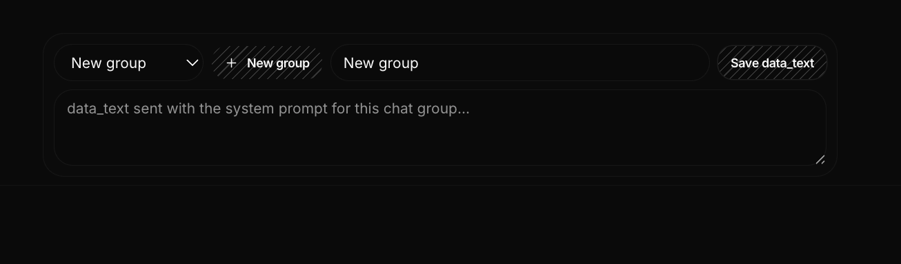

Spec6

Spec6 is an AI powered brand risk monitoring and management platform, it has daily check ups manual recogintion and automatic recogintion, it can help you to monitor your brand risk and manage it effectively. It can also help you to identify potential risks and take action to mitigate them. Spec6 is a powerful tool for any business that wants to protect its brand and reputation.

good ui lokwey

The twist: it's governed. Deep-research agents love to loop and quietly burn through paid web-data + LLM calls, so we'd put hard budget caps, per-source tool limits, and human-approval gates on the expensive actions.

Overview engine

The moment ppl onboard or create a group using everthing possible to 
